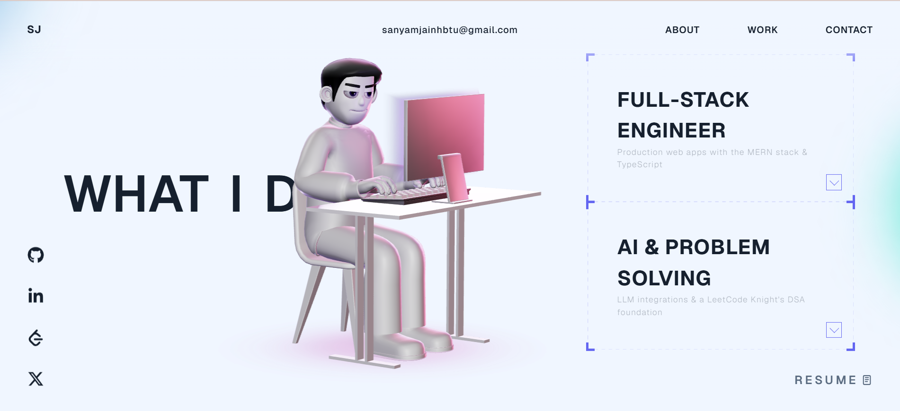

# 🚀 3D Developer Portfolio Website (React + TypeScript + Three.js)

> Portfolio of **Sanyam Jain** — Full-Stack & AI Developer (MERN + TypeScript), LeetCode Knight.

### 🔗 Live Demo: **[sanyamjainportfolio.vercel.app](https://sanyamjainportfolio.vercel.app/)**

[](https://sanyamjainportfolio.vercel.app/)

A modern, high-performance **3D developer portfolio website** built with **React**, **TypeScript**, **Three.js**, **GSAP**, and **WebGL** — featuring an interactive 3D character, smooth scroll-driven animations, and a clean light theme.

---

## ✨ Highlights

- **3D / WebGL experience** powered by **Three.js**
- Interactive 3D character with cursor tracking
- Smooth scroll animations with **GSAP**
- Modern **React + TypeScript** codebase
- Fast, responsive UI (desktop + mobile)

---

## 🧰 Tech Stack

- **React**
- **TypeScript**
- **Three.js / WebGL**
- **GSAP**
- **Vite**
- **HTML / CSS / JavaScript**

---

## 🚀 Getting Started

### 1) Clone

```bash
git clone https://github.com/sanyamhbtu/Portfolio.git
cd Portfolio
```

### 2) Install

```bash
npm install
```

### 3) Run locally

```bash
npm run dev
```

### 4) Build

```bash
npm run build
```

---

## 🧩 Customize (Quick Guide)

Most content lives in [`src/config.ts`](src/config.ts). Typical things you’ll want to update:

- **Your name + hero section text**
- **About, experience & projects**
- **Social links** (GitHub, LinkedIn, X, LeetCode)
- **Resume** — replace `public/SanyamJainResume.pdf`
- **SEO meta title/description**

---

## 🤝 Connect

- 🌐 Portfolio: https://sanyamjainportfolio.vercel.app/
- 💼 LinkedIn: https://www.linkedin.com/in/sanyam-jain-1425611b9/
- 🐙 GitHub: https://github.com/sanyamhbtu
- 𝕏 Twitter: https://x.com/SanyamJain__04

---

## 🪪 License

This project is open source and available under the **MIT License**. See [LICENSE](LICENSE).
